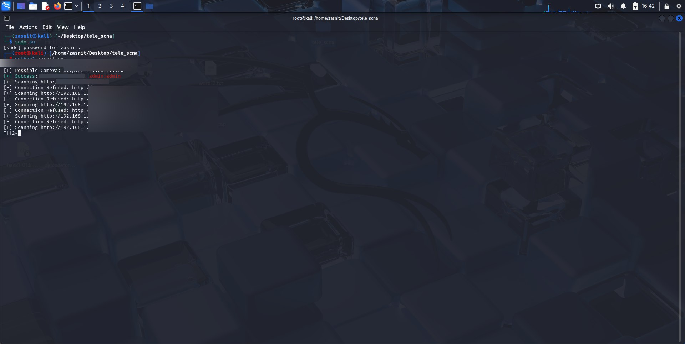

# ZAS-tool

ZAS-tool is a penetration testing tool designed to scan local networks for IP cameras, identify open ports, and perform brute-force attacks on camera login panels in order to gain access and control.

---

## Screenshot




---

## Features

- Scans the local network for connected devices
- Identifies open ports commonly used by IP cameras (e.g., 80, 554, 8080)
- Performs brute-force attacks on login interfaces
- Lightweight and easy to use
- Educational and ethical hacking purposes only

---

## Installation

Clone the repository:

```bash
git clone https://github.com/Zasnit1/ZAS-tool.git
cd ZAS-tool